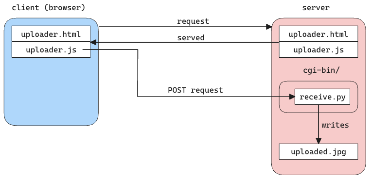

Just make sure `receive.py` is executable on the server.

With python, you can do this with: `python -m http.server 8000 --cgi` then just browse to `localhost:8000/uploader.html`.

Here's a picture of what's going on:

